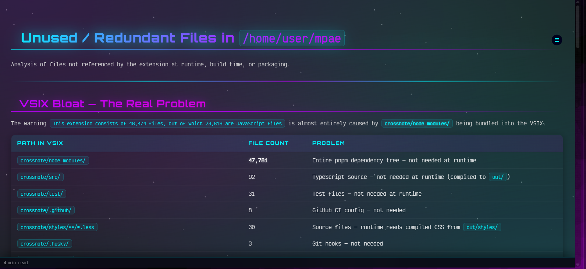
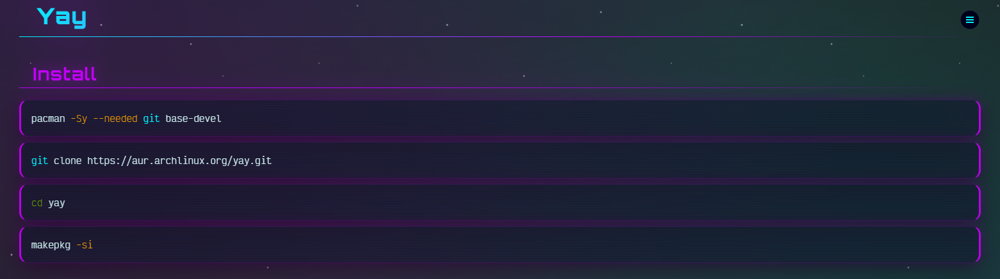
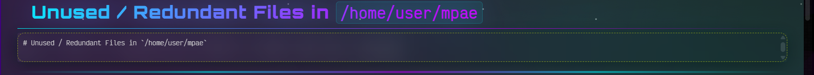
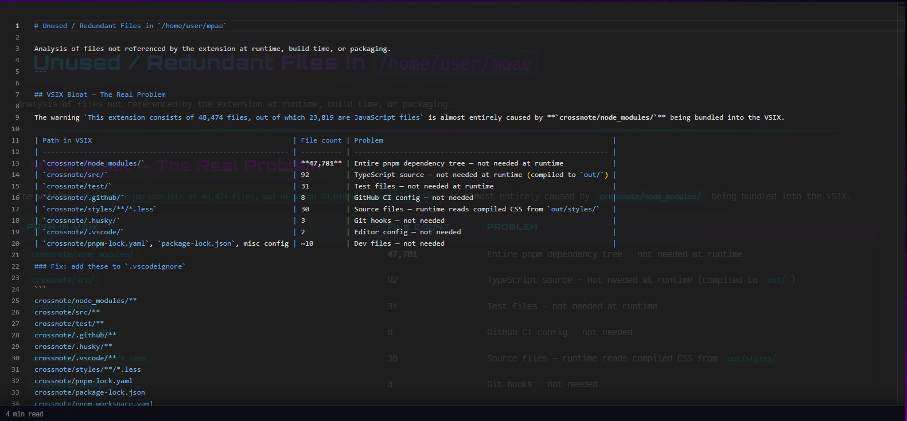

# ♠️ Markdown Preview Aces Edition ♠️

> A supercharged fork of [Markdown Preview Enhanced](https://github.com/shd101wyy/vscode-markdown-preview-enhanced) — rebuilt from the ground up with a killer new theme, a completely overhauled preview UX, and a VSIX that actually installs fast.



---

## What's New in Aces Edition

This isn't just a reskin. Every major pain point in the original extension has been tackled head-on.

### ♠️ The Default Theme: None

A brand-new custom preview theme built exclusively for this fork. Dark, vivid, punchy — it makes your markdown look incredible. Neon syntax highlighting, clean heading hierarchy, and a layout that actually breathes.



---

### ⚡ Completely Overhauled Preview UX

The old preview toolbar is gone. In its place: a sleek **floating action menu** that stays out of your way until you need it. All the common actions are right there — no hunting through menus, no wasted screen space.



---

### 📋 Code Block Copy Actions

Every code block in the preview now has instant copy actions built right in:

- **Copy Code** — grabs just the raw code
- **Edit In-Place** — opens the inline editor; or just double-click any element directly in the preview
- **Copy Markdown** — copies the full fenced block
- **Export as PNG** — Still a WIP but it is coming!

One click. Done.

---

### 🔢 Line Numbers & Source Mapping

Line numbers are now fully supported in the preview. Even better — the highlight and source mapping behavior has been significantly improved, so jumping between your preview and your source file actually works reliably.



---

### 🔗 Backlinks & TOC Improvements

The sidebar TOC and backlinks workflow has been overhauled with better in-preview controls. Navigation is faster and more intuitive, especially for longer documents.

---

### 📦 Lean, Fast VSIX — 99% Smaller

This was a serious problem in the original: the official extension VSIX shipped **48,474 files (146 MB)** because `node_modules` and build artifacts were being bundled in.

Aces Edition ships **485 files at 16 MB**. That's a **99% reduction in file count**. It installs instantly and doesn't bloat your extensions folder.

---

### 🃏 Ace of Spades Icon

The extension icon is the Ace of Spades. Because of course it is.

---

### 🔧 Ongoing Upstream Merges & Hardening

Parser and rendering fixes, markdown transform updates, and dependency updates are continuously merged from upstream MPE/Crossnote — plus local hardening and fixes on top.

---

## Roadmap & Known Issues

| Status | Area | Item |
|--------|------|------|
| 🔜 | Context Menu | Insert common elements (callouts, tables, code blocks) via right-click submenu with type selection |
| 🔜 | Fonts | Victor Mono Nerd Font for all codeblock themes (locally sourced, captures ligatures and terminal symbols) |
| 🔜 | Preview UX | Setting to auto-switch preview to right pane when "Edit in VS Code" is triggered |
| 🔜 | Context Menu | Audit right-click menu — remove broken/redundant entries, promote useful ones |
| 🔜 | Maintenance | Update all dependencies; further harden extension security and stability |
| 🔜 | Theming | Radial action menu, footer, and floating icon dock adapt appearance to match the active theme |
| 🔜 | Theming | Dynamic color palette — preview colors shift based on user-selected theme or manual palette |
| 🔜 | Callouts | Smart border sizing — callout borders fit content width instead of spanning the full row |
| 🔜 | Code Blocks | Export code block as PNG (in progress) |
| ✅ | Inline Editing | WYSIWYG double-click inline editor in the preview (partial, WIP) |
| ✅ | Context Menu | "Edit in VS Code" added to radial action menu |
| ✅ | Navigation | Collapsible sections via heading toggle buttons with localStorage persistence |
| ✅ | Code Blocks | Line numbers via `` ```lang line-numbers `` with correct syntax highlighting |
| ✅ | Theming | None theme codeblock styling — overlay, accent borders, gutter colors |
| ✅ | Theming | Fixed text color and shadows on `code`/`pre` elements |
| ✅ | Theming | Fixed line number gutter alignment and recolored to theme palette |
| ✅ | Theming | Fixed grey `<hr>` divider — replaced with gradient accent rule |
| ✅ | Build | Reduced VSIX from 48,474 files / 146 MB → 485 files / 16 MB |

---

## Installation

1. Go to the [**Releases**](../../releases) page and download the latest `.vsix` file.
2. In VS Code or code-server, open the Command Palette (`Ctrl+Shift+P`) and run:
   ```
   Extensions: Install from VSIX...
   ```
3. Select the downloaded `.vsix` file. Done.

---

## Changelog

See [`CHANGELOG.md`](CHANGELOG.md) for the full history.

