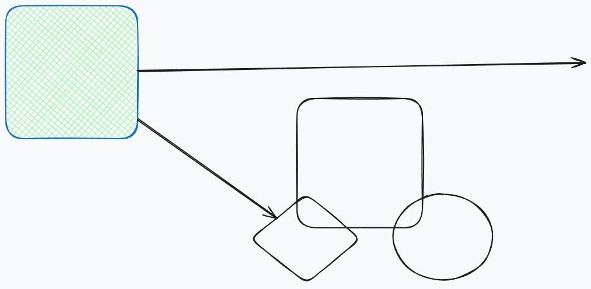

# Excalidraw Integration Test
## Simple Test, just shapes:
```excalidraw
{"elements":[{"id":"n7S8LQ-rr_De5q_eGHaLw","type":"rectangle","x":366,"y":146,"width":226,"height":228,"angle":0,"strokeColor":"#1971c2","backgroundColor":"#b2f2bb","fillStyle":"cross-hatch","strokeWidth":2,"strokeStyle":"solid","roughness":1,"opacity":100,"groupIds":[],"frameId":null,"index":"a0","roundness":{"type":3},"seed":578761391,"version":380,"versionNonce":1660192739,"isDeleted":false,"boundElements":[{"id":"vaGjPN4Ja76hAerQR9Hx3","type":"arrow"},{"id":"eoMbzEcjK2sRASDKc3WpI","type":"arrow"}],"updated":1785447094406,"link":null,"locked":false},{"id":"dDyIngcx0cf2mnPVS59VY","type":"rectangle","x":865,"y":305,"width":215,"height":222,"angle":0,"strokeColor":"#1e1e1e","backgroundColor":"transparent","fillStyle":"solid","strokeWidth":2,"strokeStyle":"solid","roughness":1,"opacity":100,"groupIds":[],"frameId":null,"index":"a1","roundness":{"type":3},"seed":666053711,"version":120,"versionNonce":232199119,"isDeleted":false,"boundElements":[],"updated":1785446250530,"link":null,"locked":false},{"id":"FFH0KFWFJI720_uQfWLmj","type":"ellipse","x":1030,"y":469,"width":170,"height":148,"angle":0,"strokeColor":"#1e1e1e","backgroundColor":"transparent","fillStyle":"solid","strokeWidth":2,"strokeStyle":"solid","roughness":1,"opacity":100,"groupIds":[],"frameId":null,"index":"a2","roundness":{"type":2},"seed":2129057921,"version":116,"versionNonce":506918209,"isDeleted":false,"boundElements":[],"updated":1785446253766,"link":null,"locked":false},{"id":"1Ek42-M8yCwVrJYefQbPe","type":"diamond","x":786,"y":469,"width":188,"height":153,"angle":0,"strokeColor":"#1e1e1e","backgroundColor":"transparent","fillStyle":"solid","strokeWidth":2,"strokeStyle":"solid","roughness":1,"opacity":100,"groupIds":[],"frameId":null,"index":"a3","roundness":{"type":2},"seed":622360943,"version":140,"versionNonce":1941215599,"isDeleted":false,"boundElements":[{"id":"vaGjPN4Ja76hAerQR9Hx3","type":"arrow"}],"updated":1785446262224,"link":null,"locked":false},{"id":"vaGjPN4Ja76hAerQR9Hx3","type":"arrow","x":592,"y":340.4608848310594,"width":238.2112150581661,"height":169.7047619112691,"angle":0,"strokeColor":"#1e1e1e","backgroundColor":"transparent","fillStyle":"solid","strokeWidth":2,"strokeStyle":"solid","roughness":1,"opacity":100,"groupIds":[],"frameId":null,"index":"a4","roundness":{"type":2},"seed":229852239,"version":441,"versionNonce":1767845869,"isDeleted":false,"boundElements":[],"updated":1785447081887,"link":null,"locked":false,"points":[[0,0],[238.2112150581661,169.7047619112691]],"startBinding":{"elementId":"n7S8LQ-rr_De5q_eGHaLw","mode":"inside","fixedPoint":[0.25663716814159293,0.34649122807017546],"focus":0},"endBinding":{"elementId":"1Ek42-M8yCwVrJYefQbPe","mode":"inside","fixedPoint":[0.3882978723404255,0.5686274509803921],"focus":0},"startArrowhead":null,"endArrowhead":"arrow","elbowed":false,"lastCommittedPoint":null},{"id":"eoMbzEcjK2sRASDKc3WpI","type":"arrow","x":592,"y":257.94545454545454,"width":767,"height":13.945454545454538,"angle":0,"strokeColor":"#1e1e1e","backgroundColor":"transparent","fillStyle":"solid","strokeWidth":2,"strokeStyle":"solid","roughness":1,"opacity":100,"groupIds":[],"frameId":null,"index":"a5","roundness":{"type":2},"seed":742632641,"version":422,"versionNonce":120367693,"isDeleted":false,"boundElements":[],"updated":1785447081887,"link":null,"locked":false,"points":[[0,0],[767,-13.945454545454538]],"startBinding":{"elementId":"n7S8LQ-rr_De5q_eGHaLw","mode":"inside","fixedPoint":[0.5530973451327433,0.27631578947368424],"focus":0},"endBinding":null,"startArrowhead":null,"endArrowhead":"arrow","elbowed":false,"lastCommittedPoint":null}],"appState":{"showWelcomeScreen":false,"theme":"light","currentChartType":"bar","currentItemBackgroundColor":"#b2f2bb","currentItemEndArrowhead":"arrow","currentItemFillStyle":"cross-hatch","currentItemFontFamily":5,"currentItemFontSize":20,"currentItemOpacity":100,"currentItemRoughness":1,"currentItemStartArrowhead":null,"currentItemStrokeColor":"#1971c2","currentItemRoundness":"round","currentItemArrowType":"round","currentItemStrokeStyle":"solid","currentItemStrokeWidth":2,"currentItemTextAlign":"left","currentHoveredFontFamily":null,"cursorButton":"up","activeEmbeddable":null,"newElement":null,"editingTextElement":null,"editingGroupId":null,"editingLinearElement":null,"activeTool":{"type":"selection","customType":null,"locked":false,"lastActiveTool":null},"penMode":false,"penDetected":false,"errorMessage":null,"exportBackground":true,"exportScale":1,"exportEmbedScene":false,"exportWithDarkMode":false,"fileHandle":null,"gridSize":20,"gridStep":5,"gridModeEnabled":false,"isBindingEnabled":true,"defaultSidebarDockedPreference":false,"isLoading":false,"isResizing":false,"isRotating":false,"lastPointerDownWith":"mouse","multiElement":null,"name":"Untitled-2026-07-30-1618","contextMenu":null,"openMenu":null,"openPopup":null,"openSidebar":null,"openDialog":null,"pasteDialog":{"shown":false,"data":null},"previousSelectedElementIds":{},"resizingElement":null,"scrolledOutside":false,"scrollX":-130,"scrollY":-97,"selectedElementIds":{"n7S8LQ-rr_De5q_eGHaLw":true,"dDyIngcx0cf2mnPVS59VY":true,"FFH0KFWFJI720_uQfWLmj":true,"1Ek42-M8yCwVrJYefQbPe":true,"vaGjPN4Ja76hAerQR9Hx3":true,"eoMbzEcjK2sRASDKc3WpI":true},"hoveredElementIds":{},"selectedGroupIds":{},"selectedElementsAreBeingDragged":false,"selectionElement":null,"shouldCacheIgnoreZoom":false,"stats":{"open":false,"panels":3},"startBoundElement":null,"suggestedBindings":[],"frameRendering":{"enabled":true,"clip":true,"name":true,"outline":true},"frameToHighlight":null,"editingFrame":null,"elementsToHighlight":null,"toast":null,"viewBackgroundColor":"#f8f9fa","zenModeEnabled":false,"zoom":{"value":1},"viewModeEnabled":false,"pendingImageElementId":null,"showHyperlinkPopup":false,"selectedLinearElement":null,"snapLines":[],"originSnapOffset":null,"objectsSnapModeEnabled":false,"userToFollow":null,"followedBy":"Set()","isCropping":false,"croppingElementId":null,"searchMatches":[],"offsetLeft":32,"offsetTop":229.390625,"width":329,"height":420},"files":{}}
```


